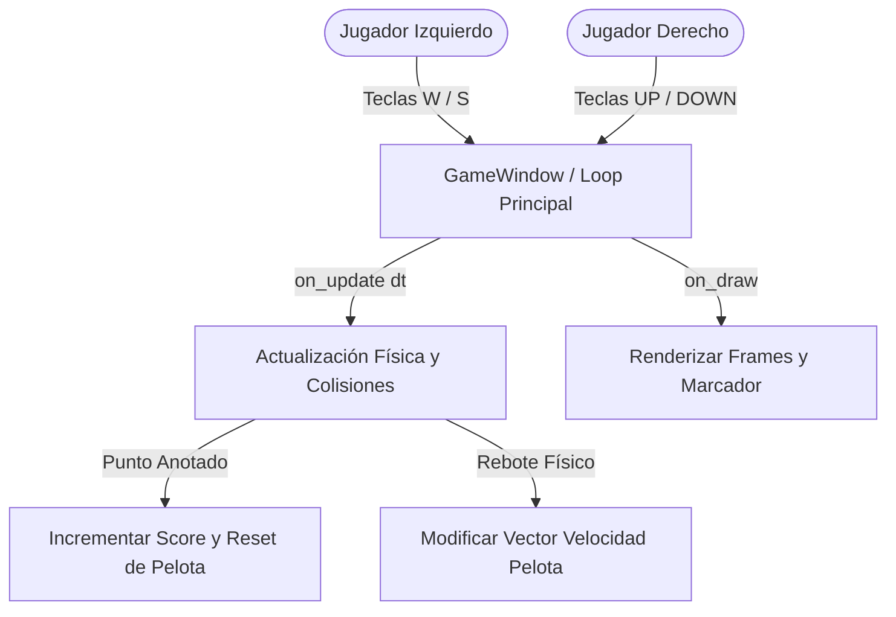

# Documento Técnico Maestro: Contexto y Auditoría del Proyecto Pong Arcade OOP

Este documento proporciona una auditoría técnica y análisis estático exhaustivo del videojuego **Pong Arcade OOP**. Ha sido elaborado desde la perspectiva de un Arquitecto de Software Principal e Ingeniero de Datos Senior, con el objetivo de servir como referencia técnica única y contexto de alta fidelidad para desarrolladores e inteligencias artificiales.

---

## 1. Visión General y Dominio del Proyecto

### Objetivo Core
El propósito fundamental de este sistema es proporcionar una implementación educativa, modular y orientada a objetos (OOP) del juego clásico bidimensional **Pong**. 

A nivel de negocio/educación, el sistema resuelve los siguientes problemas de dominio:
1. **Modelado Orientado a Objetos en Videojuegos**: Demuestra la encapsulación de entidades físicas móviles ([Paddle](file:///d:/Desktop/Proyecto%20Ense%C3%B1anza/Pong_Arcade/src/models.py#L20) y [Ball](file:///d:/Desktop/Proyecto%20Ense%C3%B1anza/Pong_Arcade/src/models.py#L47)) extendiendo componentes de la biblioteca de renderizado (`arcade.Sprite`).
2. **Independencia de Frame Rate (Delta Time)**: Resuelve el problema de la variabilidad del tiempo de ejecución entre plataformas con diferentes frecuencias de actualización (Hz).
3. **Manejo de Concurrencia de Controles**: Evita la pérdida o interrupción de entradas cuando dos jugadores operan simultáneamente en el mismo teclado.

El estado de desarrollo actual corresponde a un **Prototipo Funcional Local Inmediato (MVP)**. El juego cuenta con soporte interactivo completo para dos jugadores en la misma pantalla física, detección de colisiones bounding box de dos ejes, sistema de puntuación acumulativo en memoria y un bucle de reinicio del estado (saque). Carece de interfaces de usuario auxiliares (menús, pausa, game over), persistencia histórica del marcador y sonido.

### Casos de Uso Principales

A continuación se detallan los flujos y transacciones principales representados en el sistema:



*   **Caso de Uso 1: Control de Paletas (Input de Usuario)**:
    *   **Actores**: Jugador Izquierdo (Humano), Jugador Derecho (Humano).
    *   **Flujo**: El usuario presiona o libera teclas de dirección. El componente controlador almacena estos estados en un búfer dinámico de teclas presionadas (`pressed_keys`) y recalcula de forma inmediata las velocidades verticales de las paletas.
*   **Caso de Uso 2: Procesamiento de Ciclo de Vida Físico (Game Update Loop)**:
    *   **Actor**: Demonio interno del motor de Arcade (Event Loop).
    *   **Flujo**: Cada frame, el motor calcula la diferencia temporal con el frame anterior (`delta_time`), desplaza las coordenadas espaciales $(X, Y)$ de las entidades en base a su velocidad lineal ponderada por el factor de FPS, y evalúa las colisiones con límites o paletas.
*   **Caso de Uso 3: Transacción de Puntuación (Score Update & Resets)**:
    *   **Actor**: Motor de reglas físicas (`GameWindow`).
    *   **Flujo**: Si la coordenada horizontal de la pelota supera el límite izquierdo o derecho de la ventana gráfica, se detiene el juego temporalmente, se incrementa la puntuación del jugador correspondiente en el modelo de datos en memoria, y se invoca el reinicio de la posición de la pelota direccionando el vector inicial al jugador perdedor.

---

## 2. Matriz del Stack Tecnológico

El análisis estático de los ficheros de configuración (`requirements.txt`) y de los módulos de código revela la siguiente infraestructura de software:

| Capa Tecnológica | Tecnología / Biblioteca | Versión Detectada | Propósito y Responsabilidad dentro del Sistema |
| :--- | :--- | :--- | :--- |
| **Presentación / Cliente** | `arcade` | `3.3.3` | Framework gráfico de renderizado 2D basado en OpenGL. Gestiona la ventana de visualización, dibuja formas geométricas primitivas en tiempo real (`arcade.draw_lbwh_rectangle_filled`, `arcade.draw_circle_filled`) y renderiza fuentes tipográficas para la puntuación. |
| | `pyglet` | `2.1.14` | Dependencia core de `arcade`. Actúa como el puente de bajo nivel con el sistema de ventanas del OS y gestiona el contexto OpenGL. |
| **Lógica de Servidor / Aplicación** | Python Standard Library | `3.10+` | Entorno de ejecución principal. Se detecta el uso de tipos de datos complejos en memoria como `set` y anotaciones estáticas auxiliares mediante `typing` y la importación de `__future__.annotations`. |
| | `attrs` | `26.1.0` | Utilizada internamente por las dependencias del motor gráfico para la definición ágil de clases y tipado. |
| | `typing_extensions` | `4.15.0` | Proporciona backports de tipado estático avanzado para versiones previas de Python. |
| **Capa de Datos & Almacenamiento**| Estructuras en Memoria Volátil | N/A | El estado del marcador y coordenadas se almacena en memoria de acceso aleatorio (RAM) por medio de instancias mutables de clases y la estructura [`Score`](file:///d:/Desktop/Proyecto%20Ense%C3%B1anza/Pong_Arcade/src/models.py#L15) (dataclass). |
| | `pillow` | `11.3.0` | Biblioteca de manipulación de imágenes incluida en el stack de dependencias. Actualmente inactiva, pero reservada para operaciones futuras de carga de sprites texturizados. |
| **Infraestructura & Herramientas** | `.venv` | N/A | Entorno virtual de Python aislado para la compilación y ejecución controlada del videojuego. |
| | `requirements.txt` | N/A | Archivo de gestión de dependencias y fijación de versiones de librerías de terceros. |
| | `pymunk` | `6.9.0` | Motor de física rígida 2D basado en C (Chipmunk). Se encuentra instalado en el entorno de ejecución, aunque **no se está explotando** en la lógica actual de colisiones (el juego utiliza colisiones geométricas AABB manuales en su lugar). |
| | `pytiled_parser` | `2.2.9` | Analizador de mapas generados en Tiled. Instalado en el entorno de desarrollo pero inactivo. |

---

## 3. Arquitectura del Sistema y Flujo de Datos

### Patrón Arquitectónico
El sistema está diseñado bajo una arquitectura de **Monolito Modular Acoplado por Eventos**, estructurado internamente mediante un patrón similar a **Model-View-Controller (MVC)** simplificado:

*   **Modelo (State & Logic Containers)**: Definido en [`src/models.py`](file:///d:/Desktop/Proyecto%20Ense%C3%B1anza/Pong_Arcade/src/models.py). Las clases [`Paddle`](file:///d:/Desktop/Proyecto%20Ense%C3%B1anza/Pong_Arcade/src/models.py#L20) y [`Ball`](file:///d:/Desktop/Proyecto%20Ense%C3%B1anza/Pong_Arcade/src/models.py#L47) representan el estado del dominio (coordenadas, dimensiones, velocidades) y encapsulan la lógica elemental de autodesplazamiento y límites físicos individuales.
*   **Controlador / Bucle (Application Runner & Collision Engine)**: Representado por la clase [`GameWindow`](file:///d:/Desktop/Proyecto%20Ense%C3%B1anza/Pong_Arcade/src/main.py#L20) en [`src/main.py`](file:///d:/Desktop/Proyecto%20Ense%C3%B1anza/Pong_Arcade/src/main.py). Controla la entrada de datos de periféricos (teclado), evalúa de manera centralizada la interacción entre entidades (colisiones pelota-paleta y control de puntos) y gestiona los cambios de fase física.
*   **Vista (OpenGL Renderer)**: Implementada mediante la combinación de los métodos `.draw()` de cada modelo que hacen uso de las APIs de bajo nivel de dibujo en pantalla de `arcade`, orquestados y limpiados por el método `.on_draw()` de [`GameWindow`](file:///d:/Desktop/Proyecto%20Ense%C3%B1anza/Pong_Arcade/src/main.py#L52).

```
+-------------------------------------------------------------+
|                        CAPA DE ENTRADA                      |
|  [on_key_press] -------------> (pressed_keys: set) <------+ |
|  [on_key_release] ----------------------------------------+ |
+------------------------------+------------------------------+
                               |
                               v
+-------------------------------------------------------------+
|                   CONTROLADOR DE EVENTOS                    |
|                        (GameWindow)                         |
|                                                             |
|   +-----------------------+      +-----------------------+  |
|   |       on_update       |      |        on_draw        |  |
|   |  - Orquesta físicas   |      |  - Limpia la pantalla |  |
|   |  - Evalúa colisiones  |      |  - Invoca .draw() en  |  |
|   |  - Modifica Score     |      |    los modelos        |  |
|   +-----------+-----------+      +-----------+-----------+  |
+---------------|------------------------------|--------------+
                |                              |
                v                              v
+-------------------------------------------------------------+
|                        CAPA DE DATOS                        |
|                                                             |
|      [GameConfig] ----------> [Paddle] -------> (.draw())   |
|          |                 (left / right)                   |
|          +------------------> [Ball] ---------> (.draw())   |
|          |                                                  |
|          +------------------> [Score]                       |
+-------------------------------------------------------------+
```

### Comunicación e Integración
1.  **Inyección de Configuración**: La instancia global [`GameConfig`](file:///d:/Desktop/Proyecto%20Ense%C3%B1anza/Pong_Arcade/src/config.py#L5) se propaga en el momento de la instanciación a [`Paddle`](file:///d:/Desktop/Proyecto%20Ense%C3%B1anza/Pong_Arcade/src/models.py#L21) y [`Ball`](file:///d:/Desktop/Proyecto%20Ense%C3%B1anza/Pong_Arcade/src/models.py#L48), asegurando que haya una única fuente de verdad física para constantes de velocidad, anchura, altura y límites.
2.  **Bucle de Mensajería de Entrada**: La comunicación entre periféricos y movimiento se realiza mediante la variable de clase `pressed_keys` de [`GameWindow`](file:///d:/Desktop/Proyecto%20Ense%C3%B1anza/Pong_Arcade/src/main.py#L27). Esto desacopla el evento de interrupción de teclado de la actualización del modelo físico:
    *   Al presionar teclas, se añaden a un `set` de Python.
    *   Al liberar teclas, se remueven del `set`.
    *   El método `update_paddle_velocities()` evalúa el estado del `set` y actualiza `change_y` en los objetos [`Paddle`](file:///d:/Desktop/Proyecto%20Ense%C3%B1anza/Pong_Arcade/src/models.py#L20).

### Flujo de Datos (Data Flow)
El ciclo de vida de los datos del juego se procesa frame por frame mediante las siguientes etapas:

1.  **Entrada (Input)**: El buffer de eventos del hardware (sistema operativo) captura eventos de teclado que son inyectados en [`GameWindow`](file:///d:/Desktop/Proyecto%20Ense%C3%B1anza/Pong_Arcade/src/main.py#L20) mediante `on_key_press` y `on_key_release`.
2.  **Transformación Física y Lógica (Processing)**:
    *   Se calcula la fracción de segundo transcurrida (`delta_time`).
    *   Se procesa [`Paddle.update`](file:///d:/Desktop/Proyecto%20Ense%C3%B1anza/Pong_Arcade/src/models.py#L32) para cada paleta: se aplica el desplazamiento vertical y se realiza un *clamping* contra los límites de pantalla de `GameConfig`.
    *   Se procesa [`Ball.update`](file:///d:/Desktop/Proyecto%20Ense%C3%B1anza/Pong_Arcade/src/models.py#L63): la pelota se desplaza en base a `(dx, dy)`. Si cruza los límites horizontales de la pantalla, se evalúa si hay rebote en el techo o suelo (invirtiendo el signo de `dy`).
    *   Se procesa la detección de colisiones de Bounding Box AABB en [`GameWindow.on_update`](file:///d:/Desktop/Proyecto%20Ense%C3%B1anza/Pong_Arcade/src/main.py#L70). Si hay intersección física entre pelota y paletas, se calcula la nueva dirección de rebote en el eje X (`dx`).
3.  **Persistencia (State Updates)**:
    *   Si se detecta que la pelota supera los márgenes laterales ($X < 0$ o $X > \text{width}$), se altera directamente el estado en memoria de la clase [`Score`](file:///d:/Desktop/Proyecto%20Ense%C3%B1anza/Pong_Arcade/src/models.py#L15) incrementando en 1 el contador del jugador ganador.
    *   Se invoca el método [`Ball.reset`](file:///d:/Desktop/Proyecto%20Ense%C3%B1anza/Pong_Arcade/src/models.py#L57), devolviendo la pelota a las coordenadas centrales de la pantalla y redefiniendo el vector de velocidad horizontal hacia el lado del saque correspondiente.
4.  **Retorno / Presentación (Output Rendering)**:
    *   `on_draw` limpia el búfer de imagen y llama recursivamente a los métodos `draw()` de cada modelo, los cuales envían llamadas a las funciones de renderizado de la biblioteca `arcade` para actualizar el búfer de pantalla de la GPU.

---

## 4. Lógica de Negocio Core y Reglas de Dominio

El código del proyecto contiene varias reglas matemáticas y del dominio de juego implementadas para garantizar la precisión física y la jugabilidad:

### Regla 1: Delimitación Vertical de Paletas (Screen Boundary Clamping)
*   **Propósito**: Evitar que las paletas del jugador salgan total o parcialmente de la ventana física visible de renderizado.
*   **Complejidad Algorítmica**: $O(1)$.
*   **Fórmula Matemática**:
    $$\text{center\_y}_{\text{final}} = \max\left(\frac{H_{\text{paddle}}}{2}, \min\left(H_{\text{pantalla}} - \frac{H_{\text{paddle}}}{2}, \text{center\_y}_{\text{actual}} + V_{y} \cdot dt \cdot 60\right)\right)$$
*   **Código Fuente**: [models.py:L35-L37](file:///d:/Desktop/Proyecto%20Ense%C3%B1anza/Pong_Arcade/src/models.py#L35-L37)
    ```python
    half_height = self.height / 2
    self.center_y = max(half_height,
                        min(config.height - half_height, self.center_y))
    ```

### Regla 2: Vector de Colisión Unidireccional Absoluto (Evitar Atrapamiento de Pelota)
*   **Propósito**: En motores físicos sencillos, cuando un objeto se desplaza a gran velocidad puede terminar solapando coordenadas con el cuerpo colisionador. Si se usa una simple inversión de velocidad $dx = dx \cdot -1$, al siguiente frame la pelota puede seguir en contacto físico con la paleta y revertirse nuevamente, quedando "atrapada" en un bucle infinito de colisión interna.
*   **Complejidad Algorítmica**: $O(1)$.
*   **Fórmulas Matemáticas**:
    $$\text{Colisión Paleta Izquierda} \implies dx_{\text{final}} = |dx_{\text{actual}}|$$
    $$\text{Colisión Paleta Derecha} \implies dx_{\text{final}} = -|dx_{\text{actual}}|$$
*   **Código Fuente**: [main.py:L75-L86](file:///d:/Desktop/Proyecto%20Ense%C3%B1anza/Pong_Arcade/src/main.py#L75-L86)
    ```python
    if (abs(self.ball.center_x - self.left_paddle.center_x) <= ...):
        self.ball.dx = abs(self.ball.dx)  # Obliga a ir a la derecha
    
    if (abs(self.ball.center_x - self.right_paddle.center_x) <= ...):
        self.ball.dx = -abs(self.ball.dx) # Obliga a ir a la izquierda
    ```

### Regla 3: Normalización de Desplazamiento por Fracción Temporal (Delta Time Scaling)
*   **Propósito**: Garantizar que el juego corra a una velocidad consistente sin importar si el hardware ejecuta el renderizado a 30 FPS, 60 FPS, 144 FPS o superior. El desplazamiento se calcula multiplicando el delta de tiempo real por la tasa ideal objetivo (60 unidades por segundo).
*   **Complejidad Algorítmica**: $O(1)$.
*   **Fórmula Matemática**:
    $$\text{Posición}_{t+1} = \text{Posición}_{t} + \text{Velocidad} \cdot dt \cdot 60$$
*   **Código Fuente**: [models.py:L33](file:///d:/Desktop/Proyecto%20Ense%C3%B1anza/Pong_Arcade/src/models.py#L33) y [models.py:L64-L65](file:///d:/Desktop/Proyecto%20Ense%C3%B1anza/Pong_Arcade/src/models.py#L64-L65)
    ```python
    self.center_y += self.change_y * dt * 60
    # ...
    self.center_x += self.dx * dt * 60
    self.center_y += self.dy * dt * 60
    ```

### Regla 4: Algoritmo de Intersección de Cajas Alineadas en los Ejes (AABB Collision)
*   **Propósito**: Detectar el contacto geométrico bidimensional entre la pelota redonda (simplificada como un cuadrado de lados iguales a su radio) y la paleta rectangular.
*   **Complejidad Algorítmica**: $O(1)$.
*   **Fórmula Matemática**:
    $$\text{Colisión} \iff \Delta X \le \left(\frac{W_{\text{paddle}}}{2} + R_{\text{ball}}\right) \land \Delta Y \le \left(\frac{H_{\text{paddle}}}{2} + R_{\text{ball}}\right)$$
    donde $\Delta X = |x_{\text{ball}} - x_{\text{paddle}}|$ y $\Delta Y = |y_{\text{ball}} - y_{\text{paddle}}|$.
*   **Código Fuente**: [main.py:L76-L86](file:///d:/Desktop/Proyecto%20Ense%C3%B1anza/Pong_Arcade/src/main.py#L76-L86)
    ```python
    if (abs(self.ball.center_x - self.left_paddle.center_x)
            <= (self.left_paddle.width / 2 + self.ball.radius)
        and abs(self.ball.center_y - self.left_paddle.center_y)
            <= (self.left_paddle.height / 2 + self.ball.radius)):
        ...
    ```

---

## 5. Topología del Repositorio

A continuación se muestra la distribución física y lógica del árbol de directorios del proyecto:

```text
Pong_Arcade/
├── .venv/                         # Entorno virtual aislado con dependencias locales.
├── requirements.txt               # Declaración de dependencias del framework gráfico y auxiliares.
├── project_context.md             # Fichero maestro de contexto arquitectónico y auditoría.
└── src/                           # Directorio principal que contiene el código fuente de la aplicación.
    ├── __init__.py                # Define a 'src' como un paquete importable de Python.
    ├── config.py                  # Dataclass centralizada con los parámetros iniciales del juego.
    ├── main.py                    # Punto de entrada de la aplicación y lógica del loop de la ventana.
    └── models.py                  # Declaración de modelos y comportamiento interno de entidades físicas.
```

### Diccionario Estructural y Separación de Responsabilidades

1.  **Ficheros de Configuración de Entorno**:
    *   [`requirements.txt`](file:///d:/Desktop/Proyecto%20Ense%C3%B1anza/Pong_Arcade/requirements.txt): Estipula las versiones inmutables del framework de juego y sus librerías de enlace. Asegura que el entorno de desarrollo sea idéntico entre máquinas de desarrollo.
2.  **Capa de Configuración e Inyección de Variables**:
    *   [`src/config.py`](file:///d:/Desktop/Proyecto%20Ense%C3%B1anza/Pong_Arcade/src/config.py): Contiene la clase [`GameConfig`](file:///d:/Desktop/Proyecto%20Ense%C3%B1anza/Pong_Arcade/src/config.py#L5). Centraliza el estado inmutable inicial del videojuego. Evita que valores constantes (velocidades, dimensiones físicas, paletas) estén dispersos en el código fuente.
3.  **Capa de Modelos y Datos del Dominio**:
    *   [`src/models.py`](file:///d:/Desktop/Proyecto%20Ense%C3%B1anza/Pong_Arcade/src/models.py): Contiene las entidades físicas del juego.
        *   [`Paddle`](file:///d:/Desktop/Proyecto%20Ense%C3%B1anza/Pong_Arcade/src/models.py#L20): Controla su propia velocidad lineal y realiza el clamping de sus bordes.
        *   [`Ball`](file:///d:/Desktop/Proyecto%20Ense%C3%B1anza/Pong_Arcade/src/models.py#L47): Encapsula la lógica de rebote vertical contra los límites superior e inferior de la ventana, y su reubicación al centro de la pantalla.
        *   [`Score`](file:///d:/Desktop/Proyecto%20Ense%C3%B1anza/Pong_Arcade/src/models.py#L15): Estructura pura de almacenamiento mutable para mantener el marcador actual del partido.
4.  **Capa de Control, Entrada y Renderizado**:
    *   [`src/main.py`](file:///d:/Desktop/Proyecto%20Ense%C3%B1anza/Pong_Arcade/src/main.py): Orquesta la aplicación a través de [`GameWindow`](file:///d:/Desktop/Proyecto%20Ense%C3%B1anza/Pong_Arcade/src/main.py#L20). Captura las señales directas del teclado físico, ejecuta el método `.update()` en cada una de las entidades en base al framerate real, detecta la colisión cruzada entre la pelota y las paletas, actualiza las puntuaciones e invoca las rutinas de dibujado gráfico.

---

## 6. Observaciones Técnicas y Calidad del Código

El análisis estático en profundidad ha revelado diversas áreas de mejora, posibles cuellos de botella de rendimiento y deuda técnica a considerar:

### Cuellos de Botella de Rendimiento
1.  **Detección de Colisiones AABB Redundante**:
    *   Las comprobaciones de colisión en [`GameWindow.on_update`](file:///d:/Desktop/Proyecto%20Ense%C3%B1anza/Pong_Arcade/src/main.py#L70) se evalúan frame a frame de forma secuencial en el hilo principal de ejecución. Para dos paletas no representa un problema ($O(1)$), pero si el juego añade obstáculos, paletas dinámicas adicionales o pelotas múltiples, la comparación bidireccional simple de todas las entidades escalará de forma cuadrática ($O(N^2)$).
2.  **Llamadas de Dibujo Individuales (Single-Draw Operations)**:
    *   Los modelos [`Paddle`](file:///d:/Desktop/Proyecto%20Ense%C3%B1anza/Pong_Arcade/src/models.py#L20) y [`Ball`](file:///d:/Desktop/Proyecto%20Ense%C3%B1anza/Pong_Arcade/src/models.py#L47) usan llamadas individuales a la API de Arcade para renderizarse (`arcade.draw_lbwh_rectangle_filled` y `arcade.draw_circle_filled`) en lugar de usar un sistema de listas de sprites optimizados por GPU (`arcade.SpriteList`). En la arquitectura interna de Arcade v3, la acumulación de dibujos individuales en lugar de procesamiento en lote (batch rendering) degrada severamente el rendimiento de la tarjeta gráfica si se incrementa el número de elementos concurrentes en pantalla.

### Deuda Técnica y Buenas Prácticas
1.  **Acoplamiento de la Lógica del Juego con la Capa de Presentación**:
    *   La lógica que altera las variables del estado global de la partida (como las colisiones mutuas, la verificación de si la pelota ha salido de la pantalla y el incremento de la puntuación en [`Score`](file:///d:/Desktop/Proyecto%20Ense%C3%B1anza/Pong_Arcade/src/models.py#L15)) reside directamente en la clase de visualización de la ventana [`GameWindow`](file:///d:/Desktop/Proyecto%20Ense%C3%B1anza/Pong_Arcade/src/main.py#L20). Esto dificulta enormemente la realización de pruebas unitarias automatizadas separadas de la interfaz gráfica y viola el Principio de Responsabilidad Única.
2.  **Acoplamiento de Rutas e Imports Relativos Fallidos**:
    *   Existe un control defensivo de importaciones en [`src/main.py`](file:///d:/Desktop/Proyecto%20Ense%C3%B1anza/Pong_Arcade/src/main.py#L9) y [`src/models.py`](file:///d:/Desktop/Proyecto%20Ense%C3%B1anza/Pong_Arcade/src/models.py#L9) utilizando bloques `try-except` para alternar entre importación relativa (`from .config ...`) e importación directa (`from config ...`). Esto indica que el entorno de ejecución no está unificado, permitiendo arrancar el juego tanto de forma directa (`python src/main.py`) como de forma modular (`python -m src.main`). Es aconsejable estandarizar la ejecución y utilizar un único sistema de importaciones de módulo para evitar fallos de resolución de paquetes en entornos de integración continua (CI).
3.  **Dependencias Obsoletas / Sin Uso en requirements.txt**:
    *   Librerías como `pymunk` y `pytiled_parser` están instaladas en el sistema operativo del entorno pero no son consumidas por ningún fichero de lógica de negocio. Esto incrementa la superficie de mantenimiento de dependencias y de consumo de memoria de instalación sin aportar valor directo.
4.  **Ausencia de Sanitización y Gestión de Excepciones**:
    *   La constante [`ASSETS_DIR = Path(__file__).parent / "assets"`](file:///d:/Desktop/Proyecto%20Ense%C3%B1anza/Pong_Arcade/src/main.py#L17) se declara dinámicamente, pero no hay ninguna rutina que verifique si dicha ruta existe físicamente en el disco al inicializarse el programa, ni control de excepciones (`try/except`) para capturar la ausencia de recursos multimedia que cause cierres repentinos de la aplicación.
5.  **Tipado Débil en Declaración de Variables de Instancia**:
    *   Las variables de la ventana `self.left_paddle`, `self.right_paddle` y `self.ball` se declaran con tipado explícito básico (`: Paddle`, `: Ball`), pero no se inicializan en el constructor de forma segura sino en un método secundario `setup()`. Esto puede dar lugar a avisos de tipo `AttributeError` en herramientas de análisis estático como `mypy` al no garantizarse su instanciación antes del ciclo de renderizado.

---

## 7. Instrucciones Obligatorias para la IA (System Guidelines)

> [!IMPORTANT]
> Siempre muéstrame el código actualizado y completo, indicándome los cambios realizados y/o modificados respecto a la versión anterior.
